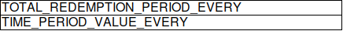

prepaid-cx-api.git

##  DOCKER BUILD
```sh
export JAVA_HOME=/usr/lib/jvm/openjdk-11.0.2_linux-x64/jdk-11.0.2
git pull
mvn clean package -DskipTests=true
sudo docker build -f Dockerfile -t fra.ocir.io/singteloracloud/singtelomcsit/prepaid-cx-membership-api:sit-0.2.9 .
sudo docker push fra.ocir.io/singteloracloud/singtelomcsit/prepaid-cx-membership-api:sit-0.2.9
```

##  DEPLOYMENT
```sh
kubectl proxy --kubeconfig /home/opc/.kube/config_prepaid_dev

kubectl delete deployment prepaid-cx-membership-api-deployment --kubeconfig /home/opc/.kube/config_prepaid_dev
kubectl create -f services.yaml --kubeconfig /home/opc/.kube/config_prepaid_dev
```

## RUNNING
```sh
mvn clean package spring-boot:run -DskipTests=true
```

##  Changelog
```sh
```

##  JMS
```sh
```

##  Sample Eligibility Request
```sh
	{
	  "dataSet": {
	    "id": "dataSet-id01",
	    "rows": [
	      [
	        "18e492fd-0c1b-4d6b-b199-62c302139380",
	        "168125468786"
	      ],
	      [
	        "28e492fd-0c1b-4d6b-b199-62c302139380",
	        "268125468786"
	      ],
	      [
	        "38e492fd-0c1b-4d6b-b199-62c302139380",
	        "368125468786"
	      ],
	      [
	        "48e492fd-0c1b-4d6b-b199-62c302139380",
	        "468125468786"
	      ],
	      [
	        "58e492fd-0c1b-4d6b-b199-62c302139380",
	        "568125468786"
	      ]
	    ],
	    "size": 0
	  },
	  "instanceContext": {
	    "appId": "97d16835-90a8-43a6-9a96-dddeacfa9362",
	    "installId": "eb2121ee-7675-4c87-9b0a-a2502892cf8f",
	    "instanceId": "d2fb3ad9-a1ab-474e-b22c-86dcde9ffc84",
	    "serviceId": "cc35bf58-049f-48cb-892b-42e1c30f899d",
	    "secret": "string",
	    "tenantId": "string",
	    "appVersion": "string",
	    "maxBatchSize": 0,
	    "maxPushBatchSize": 0,
	    "productId": "string",
	    "recordDefinition": {
	      "inputParameters": [
	        {
	          "name": "appcloud_row_correlation_id",
	          "dataType": "Text",
	          "width": 40,
	          "unique": true,
	          "required": true,
	          "readOnly": null,
	          "minimumValue": null,
	          "maximumValue": null,
	          "possibleValues": null,
	          "format": null,
	          "resources": null
	        },
	        {
	          "name": "MSISDN",
	          "dataType": "Text",
	          "width": 50,
	          "unique": null,
	          "required": null,
	          "readOnly": true,
	          "minimumValue": null,
	          "maximumValue": null,
	          "possibleValues": null,
	          "format": null,
	          "resources": null
	        }
	      ],
	      "outputParameters": [
	        {
	          "name": "appcloud_row_correlation_id",
	          "dataType": "Text",
	          "width": 40,
	          "unique": true,
	          "required": true,
	          "readOnly": null,
	          "minimumValue": null,
	          "maximumValue": null,
	          "possibleValues": null,
	          "format": null,
	          "resources": null
	        },
	        {
	          "name": "appcloud_row_status",
	          "dataType": "Text",
	          "width": 10,
	          "unique": null,
	          "required": true,
	          "readOnly": null,
	          "minimumValue": null,
	          "maximumValue": null,
	          "possibleValues": [
	            "success",
	            "warning",
	            "failure"
	          ],
	          "format": null,
	          "resources": null
	        },
	        {
	          "name": "appcloud_row_errormessage",
	          "dataType": "Text",
	          "width": 5120,
	          "unique": null,
	          "required": null,
	          "readOnly": null,
	          "minimumValue": null,
	          "maximumValue": null,
	          "possibleValues": null,
	          "format": null,
	          "resources": null
	        }
	      ]
	    }
	  },
	  "maxPullPageSize": 0,
	  "maxPushBatchSize": 0,
	  "onCompletionCallbackEndpoint": {
	    "headers": {},
	    "method": "string",
	    "url": "string"
	  },
	  "productExportEndpoint": {
	    "headers": {},
	    "method": "string",
	    "url": "string"
	  },
	  "productImportEndpoint": {
	    "headers": {},
	    "method": "string",
	    "url": "string"
	  },
	  "uuid": "string"
	}
```


##  History
```sh
#Date 2021-08-16
#1 Data Model | Alter table prepaid_cx_offer_monitoring
  add column event_campaign_name
  add column event_start_date
  add column event_end_date

#2 Java | 
  PrepaidCxOfferMonitoring.java
  add field String eventCampaignName;
  add field String eventStartDate;
  add field String eventEndDate;
  
#3 Offer Monitoring Logic
  OfferMonitoringServiceImpl.java
  pointing after applu policy to redemption process/ queue
  
```

##  History
```sh

	1. Repository
https://singteldevcs-singteloracloud.developer.ocp.oraclecloud.com/singteldevcs-singteloracloud/
troy.adianto.kartawinata@oracle.com/Welcome1234$$
2. https://console.eu-frankfurt-1.oraclecloud.com/
Singteloracloud
troy.adianto.kartawinata@oracle.com/Welcome1234$$


3. Dashboard kubernetes==
   --script
   nohup kubectl port-forward svc/dev-queue-rabbitmq 15672:15672 --kubeconfig /home/opc/.kube/config_prepaid_dev &
   --uri
   http://localhost:8001/api/v1/namespaces/kubernetes-dashboard/services/https:kubernetes-dashboard:/proxy/#/overview?namespace=defaul
   --token
   eyJhbGciOiJSUzI1NiIsImtpZCI6IjloRUJBbFQ2d3BYNGhka28xQURfYlJmbTVRc1d3djVINFhEcDhqVFRkbGsifQ.eyJpc3MiOiJrdWJlcm5ldGVzL3NlcnZpY2VhY2NvdW50Iiwia3ViZXJuZXRlcy5pby9zZXJ2aWNlYWNjb3VudC9uYW1lc3BhY2UiOiJkZWZhdWx0Iiwia3ViZXJuZXRlcy5pby9zZXJ2aWNlYWNjb3VudC9zZWNyZXQubmFtZSI6ImRhc2hib2FyZC1hZG1pbi1zYS10b2tlbi1yODQ3cCIsImt1YmVybmV0ZXMuaW8vc2VydmljZWFjY291bnQvc2VydmljZS1hY2NvdW50Lm5hbWUiOiJkYXNoYm9hcmQtYWRtaW4tc2EiLCJrdWJlcm5ldGVzLmlvL3NlcnZpY2VhY2NvdW50L3NlcnZpY2UtYWNjb3VudC51aWQiOiJlNzJhOTIzOS0xMTc5LTQwM2MtYTBlNC02ZDQzMTRhNjExZjkiLCJzdWIiOiJzeXN0ZW06c2VydmljZWFjY291bnQ6ZGVmYXVsdDpkYXNoYm9hcmQtYWRtaW4tc2EifQ.eJqJ-Xv5SFOU6or33ESOb7n_JeaAjCUDLRM5JvfN6TQavt97jW8BsdmZ6iZDjJdy4hZ8H_Afnd6y648xLfTH8sOyqH7oyTKSq1OuY1tQjoqpMhgd-RZNKecstxR92rQEf-1JAVeZbuk6EpC7V7omXC7OWtWeDdgd5CZPDZIanc0gMopfjzp0-AaoqLb4sNM0YV7stUoTbWNHHwGe__hbA1tUUBZwBmzRqj4WUQ16L4I1V8Wiw0KYqDTPDoosau8LIJekH77CcwT1GaCbdTO_BiGh8dLrB2IB_NgiVVukPoMKow7f3piuufheYW9Vnudd7Ko3VpRp2d0E1Mra52R5xA


opc@130.61.51.212

http://130.61.15.242/swagger-ui.html

instanceId
63483226-49f3-48a2-8720-4f4c47021e32


akses oracle  bQ6t2l0s97DS


=======OFFER SELECTION=====
{
  "instanceUuid": "63483226-49f3-48a2-8720-4f4c47021e32",
  "payload": {
    "notification": true,
    "offerSelections": [
      {
        "messageText1": "msg1",
        "messageText2": "msg2",
        "messageText3": "msg3",
        "messageText4": "msg4",
        "offerBucketId": "OMS|261",
        "offerBucketType": "DA",
        "offerCampaignId": 401,
        "offerCampaignName": "Name",
        "offerType": "DA",
        "promoCodeList": "F1, F2",
        "smsCampaignName": "KFC 1"
      }
    ],
    "programId": "string",
    "programName": "string",
    "type": "string",
    "uuid": "string"
  }
}


{
  "instanceUuid": "63483226-49f3-48a2-8720-4f4c47021e32",
  "payload": {
    "notification": true,
    "offerMonitoring": {
      "arpuOp": "string arpu",
      "arpuSelectedTopUpCode": "string sc",
      "arpuType": "string type",
      "arpuValue": 1,
      "countryCode": "IDN",
      "eventType": "ARPU",
      "monitorEndDate": "2021-08-31T03:29:52.939Z",
      "monitorPeriod": 0,
      "monitorPeriodDayMonth": "string",
      "monitorPeriodRadio": true,
      "monitorSpecifiedPeriodRadio": true,
      "monitorStartDate": "2021-08-31T03:29:52.939Z",
      "operatorId": "string",
      "topUpAccBalanceBeforeOp": "string",
      "topUpAccBalanceBeforeValue": 0,
      "topUpCode": "string",
      "topUpCreditMethod": "string",
      "topUpCurBalanceOp": "string",
      "topUpCurBalanceValue": 0,
      "topUpDaBalanceOp": "string",
      "topUpDaBalanceValue": 0,
      "topUpDaId": "string",
      "topUpOp": "string",
      "topUpOperator": "string",
      "topUpTempServiceClass": "string",
      "topUpTransactionValue": 0,
      "topUpUsageServiceType": "string",
      "usageOperator": "string",
      "usageServiceType": "sms",
      "usageType": "string",
      "usageValue": 0
    }
  }
}

=======EVENT CONDITION TOPUP=====
{
  "instanceUuid": "63483226-49f3-48a2-8720-4f4c47021e32",
  "payload": {
    "notification": true,
    "offerEventCondition": {
      "campaignEndDate": "2021-08-31T03:29:52.886Z",
      "campaignStartDate": "2021-08-31T03:29:52.886Z",
      "creditMethod": "M1",
      "daBalanceOp": "lessThan",
      "daBalanceValue": 0,
      "daId": "1",
      "eventConditionName": "Testing1",
      "eventConditionType": "Top-Up",
      "operatorId": "Operator 1",
      "tempServiceClass": "string",
      "topUpAccBalanceBeforeOp": "lessThan",
      "topUpAccBalanceBeforeValue": 20,
      "topUpCode": "TC1",
      "topUpCurBalanceOp": "lessThan",
      "topUpCurBalanceValue": 20,
      "topUpOp": "lessThan",
      "topUpTransactionValue": 10,
      "usageServiceType": "string"
    }
  }
}


=====OFFER MONITORING TOPUP ====

{
  "instanceUuid": "63483226-49f3-48a2-8720-4f4c47021e32",
  "payload": {
    "notification": true,
    "offerMonitoring": {
                "eventType": "string",

          "aggregationPeriodDays": 0,
          "arpuOp": "string",
          "arpuSelectedTopUpCode": "string",
          "arpuType": "string",
          "arpuValue": 0,
          "chargedAmount": "string",
          "countryCode": "string",
          "daChange": "string",
          "imei": "string",
          "monitorEndDate": "2021-09-02T07:53:25.303Z",
          "monitorPeriod": 0,
          "monitorPeriodDayMonth": "string",
          "monitorPeriodRadio": true,
          "monitorSpecifiedPeriodRadio": true,
          "monitorStartDate": "2021-09-02T07:53:25.303Z",
          "operatorId": "string",
          "topUpAccBalanceBeforeOp": "string",
          "topUpAccBalanceBeforeValue": 0,
          "topUpCode": "string",
          "topUpCreditMethod": "string",
          "topUpCurBalanceOp": "string",
          "topUpCurBalanceValue": 0,
          "topUpDaBalanceOp": "string",
          "topUpDaBalanceValue": 0,
          "topUpDaId": "string",
          "topUpOp": "string",
          "topUpOperator": "string",
          "topUpTempServiceClass": "string",
          "topUpTransactionValue": 0,
          "topUpUsageServiceType": "string",
          "usageOperator": "string",
          "usageServiceType": "string",
          "usageType": "string",
          "usageValue": 0
        }
  }
}


=====OFFER MONITORING USAGE ====

{
  "instanceUuid": "63483226-49f3-48a2-8720-4f4c47021e32",
  "payload": {
    "notification": true,
    "offerMonitoring": {
      "eventType": "Usage",
       "usageOperator": "lessThan",
          "usageServiceType": "SMS",
          "usageType": "SMS_C",
          "usageValue": 10
          "aggregationPeriodDays": 0,
           "topUpCurBalanceOp": "string",
          "topUpCurBalanceValue": 0,
           "topUpAccBalanceBeforeOp": "string",
          "topUpAccBalanceBeforeValue": 0,
            "topUpDaId": "string",
         
          "topUpDaBalanceOp": "string",
          "topUpDaBalanceValue": 0,
          "topUpTempServiceClass": "string",
          
          
          "chargedAmount": "string",
          "countryCode": "string",
          "daChange": "string",
          
          "imei": "string",
          "monitorEndDate": "2021-09-02T07:53:25.303Z",
          "monitorPeriod": 0,
          "monitorPeriodDayMonth": "string",
          "monitorPeriodRadio": true,
          "monitorSpecifiedPeriodRadio": true,
          "monitorStartDate": "2021-09-02T07:53:25.303Z",
          "operatorId": "string",
         
         
         
        }
  }
}


=====OFFER MONITORING ARPU ====
{
  "instanceUuid": "63483226-49f3-48a2-8720-4f4c47021e32",
  "payload": {
    "notification": true,
    "offerMonitoring": {
      "eventType": "ARPU",
      "operatorId": "string",
         "arpuType": "string",
          "arpuOp": "string",
          "arpuValue": 0,
          "aggregationPeriodDays": 0,
          "monitorEndDate": "2021-09-02T07:53:25.303Z",
          "monitorPeriod": 0,
          "monitorPeriodDayMonth": "string",
          "monitorPeriodRadio": false,
          "monitorSpecifiedPeriodRadio": true,
          "monitorStartDate": "2021-09-02T07:53:25.303Z"
        }
  }
}


```
```

##  Sample
```sh

{
"instanceContext": {
"appId": "97d16835-90a8-43a6-9a96-dddeacfa9362",
"installId": "eb2121ee-7675-4c87-9b0a-a2502892cf8f",
"instanceId": "d5d234de-9269-4aa5-a3e7-fad3eb42b3ed",
"serviceId": "aec078a8-1a61-43bd-ad5e-01043ebb6454",
"tenantId": "80578",
"productId": "6798e522-deb5-488f-bf22-c29e13254b8f",
"maxPushBatchSize": 1,
"secret": "16620479-5822-4403-a53e-ac42d1a1abbe-16d5232a-0e6b-4fa1-b800-3208be76c0f3",
"recordDefinition": {
"inputParameters": [
{
"name": "appcloud_row_correlation_id",
"dataType": "Text",
"width": 40,
"unique": true,
"required": true
},
{
"name": "CUSTOMER_ID_",
"dataType": "Text",
"width": 40,
"required": true,
"readOnly": true
}
],
"outputParameters": [
{
"name": "appcloud_row_correlation_id",
"dataType": "Text",
"width": 40,
"readOnly": false
},
{
"name": "appcloud_row_status",
"dataType": "Text",
"width": 40,
"readOnly": false
},
{
"name": "appcloud_row_errormessage",
"dataType": "Text",
"width": 255,
"readOnly": false
},
{
"name": "STATUS",
"dataType": "Text",
"width": 40,
"readOnly": false
}
]
},
"maxBatchSize": 1
},
"dataSet": {
"id": "456080a4-dcc5-4e9d-887c-fca6ac1df8c8",
"rows": [
[
"139690706268;8;1632118865",
"1234567890"
]
],
"size": 1
},
"productImportEndpoint": {
"url": "https://rest002.rsys8.net/rest/appcloud/v1/tenants/80578/datasets/456080a4-dcc5-4e9d-887c-fca6ac1df8c8-20210921-4375688",
"method": "POST",
"headers": {}
},
"onCompletionCallbackEndpoint": {
"url": "https://rest002.rsys8.net/rest/appcloud/v1/tenants/80578/executions/456080a4-dcc5-4e9d-887c-fca6ac1df8c8-20210921-4375688",
"method": "PATCH",
"headers": {}
},
"maxPullPageSize": 10000,
"maxPushBatchSize": 10000
}

```

##  Query
```sh
SELECT a.OFFER_MEMBERSHIP_ID, a.OFFER_CONFIG_ID, b.PROGRAM_ID, b.OVERALL_OFFER_NAME, 
a.MSISDN, a.CREATED_DATE 
FROM PREPAID_OFFER_MEMBERSHIP a 
JOIN PREPAID_CX_OFFER_CONFIG  b ON b.offer_config_id = a.OFFER_CONFIG_ID  
ORDER BY a.created_date desc ;
```